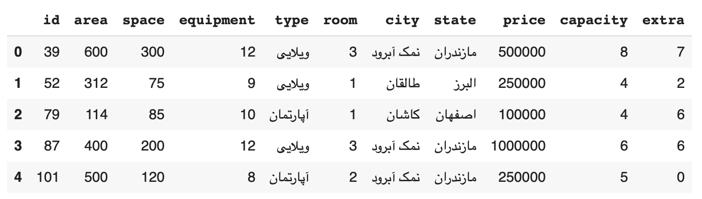

# shabdotir

**Crawl** the first 200 pages of *https://www.shab.ir* with `BeautifulSoup` and `requests` and insert each row in database whit `mysql.connector` then make ML model to predict the price of houses.

This information is collected on **2020-08-19 at 00:06**.

Here are the first five rows of this dataset:

#### Dataset information:

This data set has 4785 sample and 11 feature.

- `id` : The ID of each house in www.shab.ir
- `area` : Land area (Square meters)
- `space` : Building area (Square meters)
- `equipment` : Number of equipment like : pool, bath, tv, oven, refrigerator and ...
- `type` : Type of building : ویلایی , آپارتمان , بومگردی
- `room` : Number of rooms
- `city` : City
- `state` : State
- `price` : Price of renting for 24 hour (Toman)
- `capacity` : Basic capacity
- `extra` : Extra capacity
